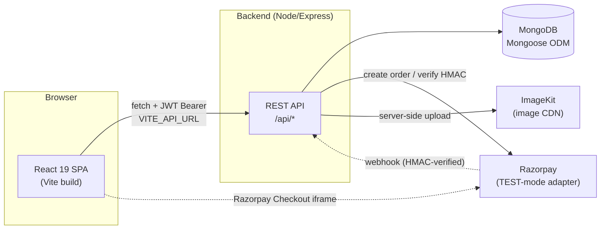
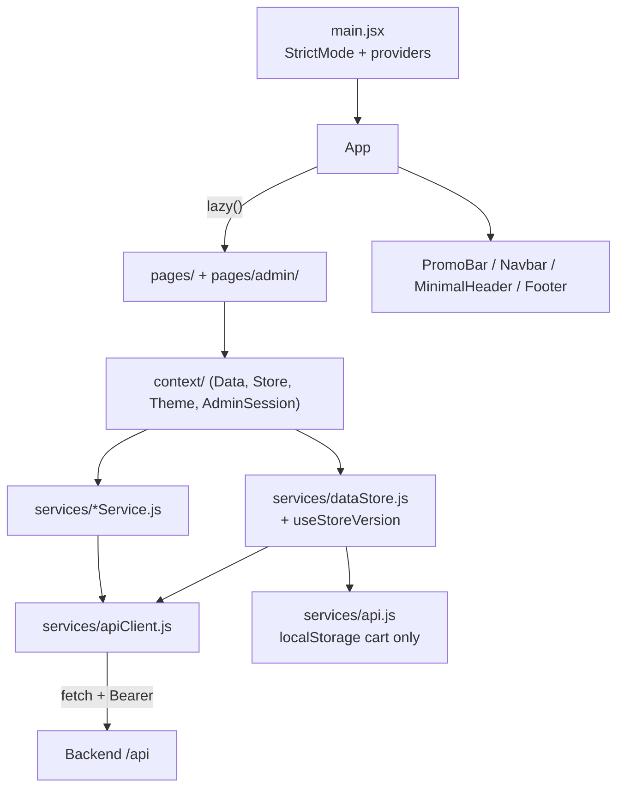
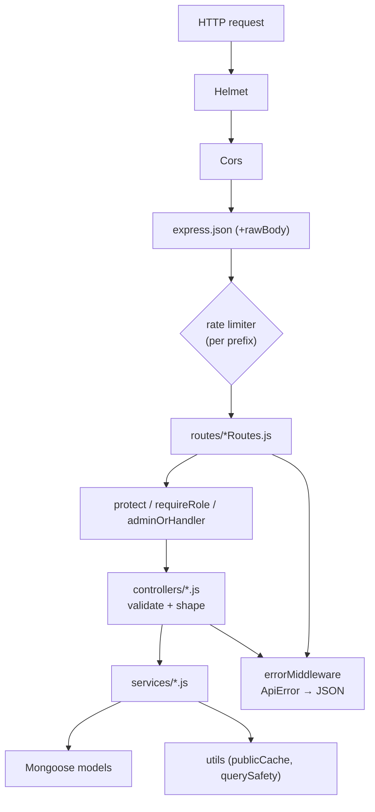
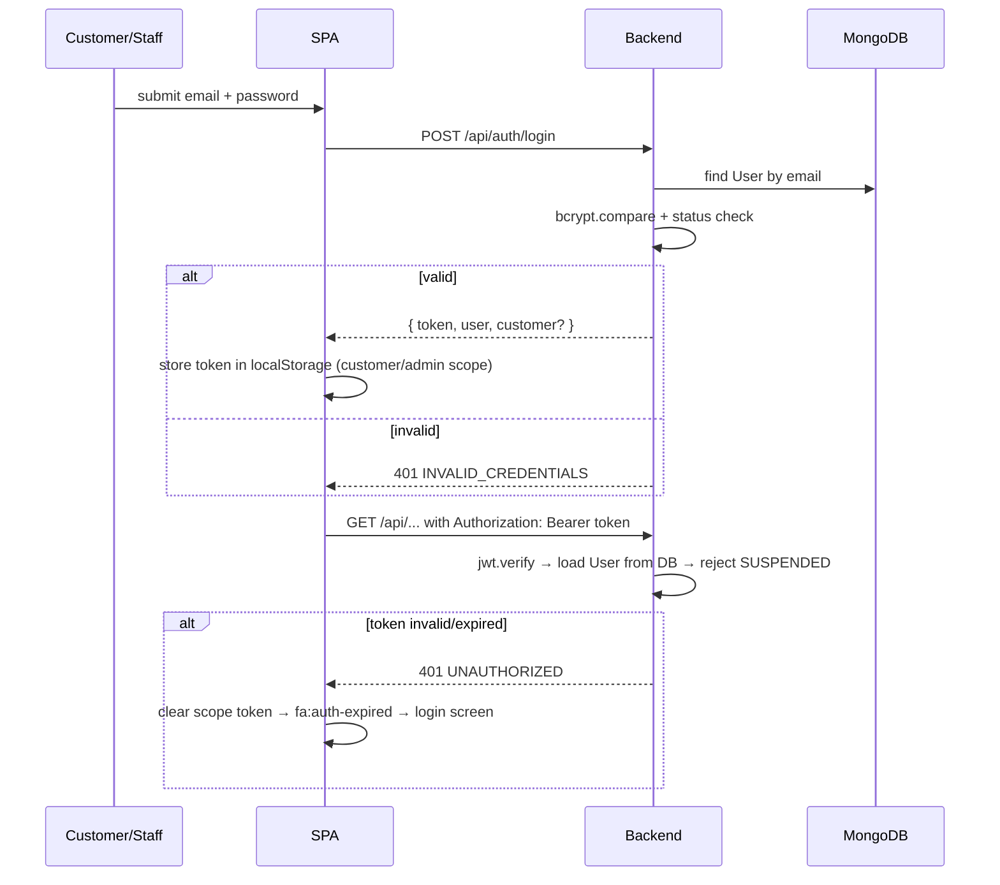
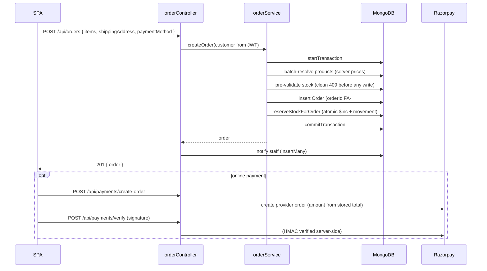
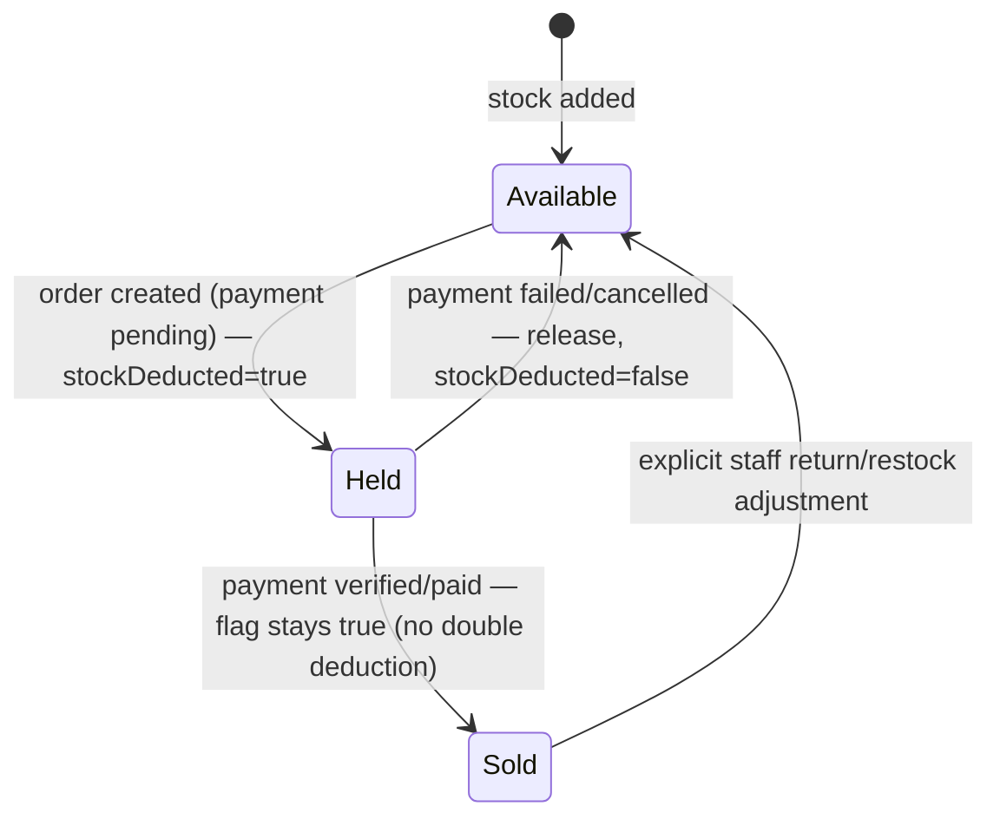

# Flora Alchemy — Architecture

> This document describes the **implemented** system as it exists in the repository.
> Anything that is only *configured*, *planned*, or a *known risk* is labelled as
> such. Related: [AGENTS.md](../AGENTS.md), [DESIGN.md](./DESIGN.md),
> [API.md](./API.md), [DATABASE.md](./DATABASE.md), [TESTING.md](./TESTING.md),
> [MEMORY.md](./MEMORY.md), [DEPLOYMENT.md](../DEPLOYMENT.md).

## 1. High-level architecture

Three-tier SPA + REST API + MongoDB, plus two optional third-party integrations
(Razorpay for payments, ImageKit for image hosting). The browser talks only to
its own backend — it never calls Razorpay or ImageKit directly for privileged
operations.

## 2. Frontend architecture

**CURRENT IMPLEMENTATION**

- **Entry** — `src/main.jsx` mounts the app inside `React.StrictMode` and nests
  providers: `BrowserRouter → DataProvider → StoreProvider → AdminSessionProvider → App`.
- **Routing** — `src/App.jsx` declares every route. **All pages are `lazy()`-loaded**
  (route-level code splitting), wrapped in a single `<Suspense>` with a
  brand-consistent skeleton fallback (`RouteFallback`). The admin portal chunks are
  downloaded only by staff.
- **Shell selection by route** — `/admin/*` renders no storefront chrome; `/checkout`
  and `/login` get `MinimalHeader` instead of `PromoBar` + `Navbar`; everything else
  gets the full marketing shell + `Footer`.
- **Auth-expiry handling** — `App.jsx` listens for the `fa:auth-expired` window event
  (dispatched by `apiClient` on a rejected token) and routes to the correct login
  screen, preserving checkout context via `?redirect=/checkout`.
- **State** — context providers (`src/context/`), no external state library:
  - `DataContext` — bootstraps the authoritative business collections from the API,
    exposes `{ ready, status, error, retry }`, and renders a full-screen loader /
    error screen.
  - `StoreContext` — the guest **cart** (browser-local), the server-backed
    **wishlist**, toasts, live stock clamping, and cart price reconciliation.
  - `ThemeContext` — light / dark / system.
  - `AdminSessionContext` — the staff session marker.
- **Data layer** — `src/services/apiClient.js` is the **single** HTTP client
  (`get/post/patch/delete`, token scoping `customer` | `admin`, 401 → session clear).
  `src/services/dataStore.js` holds the hydrated business collections, a version
  counter (`useStoreVersion`), and scope-aware refresh signals. Domain services
  (`productService`, `orderService`, `inventoryService`, …) sit on top of both.
  `src/services/api.js` persists **only** the guest cart — there is no local
  business-data mock.
- **Animation** — `src/lib/gsapSetup.js` registers GSAP + `ScrollTrigger` and exposes
  `prefersReducedMotion` / `isDesktop`. Motion is GSAP or CSS keyframes; there is no
  WebGL/three.js.

## 3. Backend architecture

**CURRENT IMPLEMENTATION**

`server.js` performs, in order: production config validation → `connectDB()` →
optional `SEED_ON_START` seeding → `app.listen()`, with graceful shutdown on
`SIGTERM`/`SIGINT` (drain → close Mongo → exit, idempotent, 10 s force timeout).

Middleware stack, in order:

1. `helmet` (strict CSP; cross-origin resource/embedder relaxed for the SPA + Razorpay iframe)
2. `cors` (explicit allowlist from `CORS_ORIGIN`; no-origin clients such as curl/tests allowed)
3. `express.json` with a 1 MB limit and a `verify` hook capturing `req.rawBody` for webhook HMAC checks
4. `/api/health` and `/api/readiness` (Mongo `readyState` check)
5. Per-prefix rate limiters, then routers
6. `notFoundHandler` → `errorHandler`

**Layering rule:** routes are thin wiring; controllers own validation + response
shaping; services own reusable business logic; models own persistence.

### Middleware

| File | Responsibility |
|---|---|
| `authMiddleware.js` | `protect` (JWT verify → load `User` from DB → reject `SUSPENDED`), `requireRole(...)`, `adminOrHandler` |
| `errorMiddleware.js` | `ApiError` class, `notFoundHandler`, `errorHandler` normalising Mongoose/duplicate/cast/JSON/multer errors to `{ success:false, message, code }` |
| `securityMiddleware.js` | Rate limiters: `loginLimiter` (counts **failed** logins only), `registerLimiter`, `paymentLimiter`, `uploadLimiter`, `notificationLimiter`, `webhookLimiter`, `apiWriteLimiter`; `REQUEST_BODY_LIMIT` |

### Controllers, routes, services

- **17 route files**, one per domain, each mounted under `/api/<domain>`.
- **15 controllers** — validation, ownership checks, response shape.
- **5 services** — `orderService` (creation, transactions, order ids, transitions),
  `inventoryService` (atomic stock + movements), `conversationService`
  (order-linked messaging + authorization), `razorpayService` (provider adapter +
  HMAC verification), `analyticsService` (aggregation).
- **Utils** — `publicCache.js` (30 s TTL read cache for public products,
  collections, settings only) and `querySafety.js` (`escapeRegExp`, `safeString`).

## 4. Database interaction

Mongoose (`strictQuery: true`, 5 s server-selection timeout) is the only data
access path. See [DATABASE.md](./DATABASE.md) for schemas, indexes and
relationships. Notable patterns:

- **Order creation and inventory reservation run inside one MongoDB session
  transaction**, with a one-retry wrapper for `WriteConflict` (code 112) so a lost
  race surfaces as a clean `409 INSUFFICIENT_STOCK` rather than a 500.
- **Atomic stock guard** — for negative deltas the `findOneAndUpdate` filter itself
  requires `currentStock >= -delta`, making an oversell structurally impossible.
- **Read cache** — public product/collection/settings reads are cached for 30 s and
  invalidated by prefix on writes. Stock counts are attached *after* the cache read
  so availability is always live.
- **N+1 avoidance** — catalogue items batch-resolve in one query; staff
  notifications use `insertMany`.

## 5. Authentication flow

**CURRENT IMPLEMENTATION** — Stateless JWTs (HS256, `JWT_EXPIRES_IN`, default 7d).
Customer and admin tokens are stored under separate keys so both can coexist.
`req.user` is always re-read from the database, so an edited token cannot forge a
role and a suspended operator loses access on the very next request.
`POST /auth/logout` is a contract endpoint only — logout is client-side token
discard (no server-side blacklist).

## 6. Customer flow

Home → Shop → Product → Add to Bag → Bag → Checkout (Account → Delivery → Payment
→ Review) → Order Success → Order Tracking → Account → Conversation.

**Implemented behaviours found in code:**

- Guest cart lives in `localStorage` (`services/api.js`); browsing never requires an account.
- Stock is clamped in the UI at add-time and quantity-change time (`StoreContext.stockOf`)
  and re-validated server-side at order creation.
- Checkout state (`step`, delivery form, shipping choice) is snapshotted to
  `sessionStorage` (`apiClient.saveCheckoutSnapshot`) so an auth round-trip or refresh
  does not restart the flow; the snapshot is consumed once on remount.
- The auth gate carries `?redirect=` and only accepts safe internal paths
  (`isSafeInternalPath` rejects protocol-relative URLs).
- Saved addresses persist to the backend address book and prefill later checkouts.
- Catalogue bag lines are re-priced from the live catalogue so the displayed total
  cannot drift from the server-priced order.
- A pending-payment recovery panel survives an emptied bag so a failed/cancelled
  payment can be retried without creating a duplicate order.

## 7. Admin flow

`/admin/login` → Dashboard → Orders / Products / Collections / Customers /
Inventory / Analytics / Settings (general, commerce, notifications, access, store
preferences) / Conversations / Custom Requests / Create Order / Create Product.

`AdminRoute` gates every portal route; the server independently enforces
`protect` + `adminOrHandler` (or `requireRole`). Portal chunks are lazy, so
storefront visitors never download admin code.

## 8. Product flow

Create/update (staff) → slug generated by `slugify(name)` → optional image upload →
public read.

- Products are keyed by **slug**; the model's `toJSON` maps `id = slug`.
- `visibility` is `Visible` | `Hidden`. Public list/detail reads return visible
  products only; a valid staff Bearer token reveals hidden ones. Hidden products
  return **404** to the public, not 403, so existence is not disclosed.
- Creating a product auto-creates an `Inventory` record (`initialStock`, default 0;
  `reorderLevel`, default 5). Editing keeps inventory coherent: a slug rename
  **migrates** the inventory record; re-enabling `stockTracked` initialises a
  missing record. Deleting a product deletes its inventory record.
- Public reads are cached 30 s (write-invalidated); stock is attached after the cache.

## 9. Order flow

- **Order ids** — `FA-####`, seeded from the database maximum at first use and
  existence-checked before use, with a final timestamp fallback, so restarts and
  concurrent instances cannot collide.
- **Lifecycle** — `new → confirmed → in_production → quality_check →
  ready_to_dispatch → shipped → delivered`, **forward-only**; `assertValidTransition`
  rejects backwards/unknown targets with `422 INVALID_TRANSITION`. `paymentStatus`
  is deliberately independent of `orderStatus`.
- **Idempotent notifications** are fired to staff on creation and to the customer
  on status change.
- Staff orders (`POST /api/orders/admin`) use `forceSamplePayment` and
  `allowLegacyPricing` (staff may price bespoke items the catalogue cannot express).

## 10. Inventory flow

- `Inventory.currentStock` is the single authoritative number (there is **no**
  available/reserved split), keyed by `productSlug` and unique.
- Every change goes through `adjustStock()`, which writes an `InventoryMovement`
  (signed `delta`, `previousStock`, `newStock`, `type`, optional `orderId`,
  `createdBy`). Movement types: `sale`, `restock`, `adjustment`, `return`,
  `correction`, `release`.
- The hold → release → re-deduct strategy is driven by the per-item
  `stockDeducted` flag, making repeated webhooks/failures idempotent. Net
  guarantee: **one paid order = exactly one final deduction**.
- Made-to-order custom gifts have `isCatalogue: false` and are never stock-tracked.
- A stock-tracked product with no inventory record is treated as stock 0
  (unavailable), never as silently purchasable.

## 11. Payment flow

- **Adapter** — `services/razorpayService.js` uses Razorpay's REST API via global
  `fetch` (no SDK). `isConfigured()` gates the whole feature: without
  `RAZORPAY_KEY_ID`/`RAZORPAY_KEY_SECRET` the app keeps its frozen prototype
  behaviour (`paymentStatus: 'Sample'`, no real charge).
- **Server-authoritative amount** — `createPaymentOrder` recomputes paise from the
  stored `order.total`; the client amount is ignored. One provider order per business
  order, reused on retry.
- **Verification** — the server verifies the HMAC against the Razorpay order id
  **it** created, using a timing-safe compare. A mismatch is rejected
  (`400 INVALID_SIGNATURE`) and never marks the order paid.
- **Failure path** — `outcome: 'failed' | 'cancelled'` records an honest `Failed`
  state and releases held stock (idempotent). An order is never silently "paid".
- **Webhook** — `POST /api/payments/webhook` is HMAC-verified against
  `RAZORPAY_WEBHOOK_SECRET`; `payment.captured` → Paid, `payment.failed` → Failed,
  both idempotent and stock-neutral. Unknown orders are acknowledged so the provider
  stops retrying.
- `cod` is not a provider checkout — it stays a delivery settlement recorded as Pending.

## 12. Conversation flow

Order-linked, one conversation per `(orderId, customerId)` pair (unique compound
index).

- Customer opens it from Order Success / Account / Tracking at
  `/order/:orderId/conversation`; staff from `/admin/orders/:orderId/conversation`.
- Authorization lives in `conversationService`: the customer must own the order;
  staff may access any. Violations are `403 FORBIDDEN`, missing records `404`.
- Sending a message updates `lastMessageAt` and notifies staff (batched
  `insertMany`); the customer is notified of staff replies.
- Closed conversations reject new messages (`409 CONVERSATION_CLOSED`); only staff
  may change status.
- Read state is tracked per user; `GET /api/conversations/unread` powers badges.

## 13. Wishlist flow

Customer-owned and server-backed — **one document per customer** (`customerId`
unique). Ownership always comes from `req.user.customerId`, never the client.

- Reads resolve stored product slugs against the catalogue and return
  `{ productIds, products, unavailableIds }` so deleted/hidden products surface
  instead of vanishing silently.
- Guests get a "Sign in to save" gate — there is no fake local wishlist.

## 14. Custom-request flow

Customer submits a bespoke brief (description ≥ 10 chars, occasion, budget, colours,
desired date, optional image) → `pending`. Staff move it through
`pending → reviewing → quoted → accepted → declined`, optionally recording internal
`adminNotes`. Staff are notified on submission, the customer on status change.
`adminNotes` are excluded from the customer-facing list (`select('-adminNotes')`).

## 15. Deployment architecture

**CONFIGURED** (declared in `render.yaml`, values set manually in the dashboard):

| Component | Host | Notes |
|---|---|---|
| Frontend | Vercel static site | `frontend/vercel.json` rewrites all paths to `/index.html` (SPA) |
| Backend | Render web service | `healthCheckPath: /api/health`, `autoDeploy: true`, `NODE_ENV=production`, `SEED_ON_START=false`, `TRUST_PROXY=true` |
| Database | MongoDB Atlas | `MONGO_URI`, `sync: false` (manual dashboard value) |

Also present: `docker-compose.yml` (mongo 7 + backend Dockerfile + nginx serving
`frontend/dist`) and `frontend/nginx.conf` (SPA fallback, asset caching, `/api/`
proxy → backend). These are a production-like **local** environment, not the live
deployment.

Production boot validation (in `server.js`) exits the process when `MONGO_URI`,
`JWT_SECRET` or `CORS_ORIGIN` is missing, or when `SEED_ON_START=true`. It only
*warns* about missing ImageKit/Razorpay credentials.

### KNOWN RISK: shared database (RELEASE BLOCKER)

The deployed Render service and local development currently resolve to the **same
MongoDB database**. Local seed/QA/cleanup writes therefore land in production, and
production writes appear locally. This is **not** an intended architecture; it is an
unresolved deployment isolation defect requiring an owner-side configuration change.
See [DATABASE.md](./DATABASE.md#release-blocker-shared-productiondevelopment-database)
and the "Data Isolation" section of [DEPLOYMENT.md](../DEPLOYMENT.md).

### Known limitation — unrouted admin page files

Three admin page files exist but are **not** registered in `App.jsx`, so they are
unreachable (`AdminLowStockPage`, `AdminStockAdjustmentPage`,
`AdminStockManagementPage`). Their functionality is covered by the live inventory
screens (`AdminInventoryPage`, `AdminInventoryHistoryPage`). They are dead files,
not hidden routes — do not assume they render anywhere.

### Known limitation — demo handler account

A seeded demo handler account is still present in the production database and
authenticates successfully. It requires rotation or removal by the owner. No
credentials are recorded in these docs.

## 16. FUTURE / PLANNED IMPROVEMENTS

Listed in `docs/project-status.md` as remaining work — **not implemented**:

- Tax / GST calculation (business decision pending; `taxEnabled` exists in settings but is `false`).
- Refund flow (business decision pending).
- Dedicated production database + secret rotation (see the release blocker above).
- Structured logging and monitoring beyond `/api/health` + `/api/readiness`.
- OpenAPI/Swagger API publication.
- Newsletter backend (the footer form is a preview and sends nothing).
- A shared rate-limit store (Redis) if ever deployed multi-instance — rate limits
  are currently **in-memory per process**.
