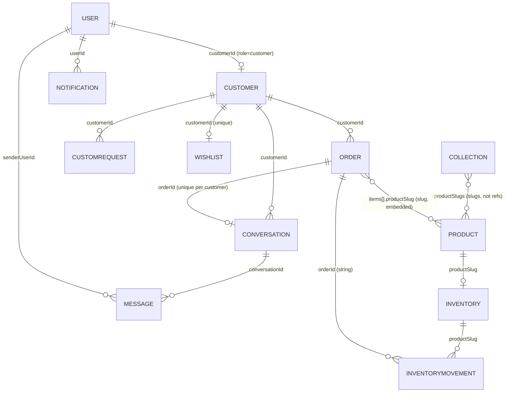

# Flora Alchemy — Database

> Derived from the Mongoose schemas in `backend/models/` (13 models). MongoDB via
> Mongoose 8, `strictQuery: true`, 5 s server-selection timeout.
> Related: [ARCHITECTURE.md](./ARCHITECTURE.md), [API.md](./API.md),
> [DEPLOYMENT.md](../DEPLOYMENT.md), [AGENTS.md](../AGENTS.md).

---

## RELEASE BLOCKER: shared production/development database

**The currently deployed production environment and local development resolve to
the same MongoDB database.** This is verified, not inferred: the deployed backend
and a local checkout use the same `MONGO_URI`, so a local write appears in the live
production API immediately (matching `_id`s, `updatedAt` timestamps, row counts and
inventory values).

**This is a deployment defect, not an intended architecture.** Consequences:

- Local seeding, QA probing and cleanup scripts mutate **production** data that
  customers see.
- Deleting or restoring records locally is a production data operation.
- Dev and production cannot be compared, because they are one dataset.
- Fixture/demo documents (`isFixture: true`) and QA residue accumulate in the live store.

**Required fix (owner-side, not code):** give the deployed API service its own
database (a distinct database name or cluster — e.g. `…/flora_alchemy_prod`) and
re-seed it. See the "Data Isolation" section of [DEPLOYMENT.md](../DEPLOYMENT.md).

**Until then:** never run destructive QA/cleanup scripts, never assume the two
environments are isolated, and always confirm the database target before any
mutation. Recorded also in [MEMORY.md](./MEMORY.md) and [AGENTS.md](../AGENTS.md).

*The automated test suites are unaffected — each suite boots its own server against
its own dedicated `Flora-Alchemy-Test-*` database.*

---

## Entity relationships

**Reference style matters.** Orders and conversations reference `Customer` by
ObjectId; inventory and movements reference products by **slug string**; order line
items embed a `productSlug` snapshot rather than a reference (so an order remains
readable if a product is later deleted or renamed). Collections reference products by
slug array, not refs.

## Identity split: `User` vs `Customer`

This is the single most important relationship to understand.

- **`User`** = authentication identity (email + `passwordHash` + `role`).
- **`Customer`** = business profile (name, addresses, spend).
- A `User` with `role: 'customer'` links to its `Customer` via `customerId`.
- `admin`/`handler` users have **no** `Customer` profile.
- `passwordHash` is deleted by the `toJSON` transform, so it can never be serialised
  into a response.

## Models

### User — `users`

| Field | Type | Notes |
|---|---|---|
| `email` | String | **required, unique, lowercase, trim, index** |
| `passwordHash` | String | **required**; bcrypt, cost 12; never serialised |
| `role` | String | enum `customer \| handler \| admin`, default `customer`, **index** |
| `name` | String | trim |
| `customerId` | ObjectId → `Customer` | **index**; only set when `role === 'customer'` |
| `status` | String | enum `ACTIVE \| SUSPENDED`, default `ACTIVE` |
| `statusChangedAt` | Date | |
| `isFixture` | Boolean | seed/demo flag (cannot be deleted via the operator API) |

`toJSON`: `id = _id`, strips `_id`/`__v`/`passwordHash`.

**Constraint:** suspended accounts are rejected at login *and* on every protected
request — suspension is not deferred to token expiry.

### Customer — `customers`

| Field | Type | Notes |
|---|---|---|
| `name` | String | **required**, trim |
| `email` | String | **required, unique, lowercase, trim, index** |
| `phone` | String | |
| `status` | String | enum `Active \| Inactive`, default `Active` |
| `addresses` | `[addressSchema]` | embedded, `_id: true` per address |
| `preferences` | Object | `{ newsletter: true, notifications: true }` |
| `totalSpend` / `orderCount` | Number | default 0 |
| `city` / `state` | String | |
| `isFixture` | Boolean | |

`addressSchema`: `label` (default `Home`), `name`, `address`, `city`, `state`,
`pincode`, `phone`, `isDefault` (default false).

Virtual: `orders` (count of `Order` where `customerId` matches).
**Constraint:** email is an identity field and is **not** editable through
`PATCH /customers/:id`. Only one address may be default.

### Product — `products`

| Field | Type | Notes |
|---|---|---|
| `slug` | String | **required, unique, lowercase, trim, index** — the public id |
| `name` | String | **required**, trim |
| `sku` | String | |
| `price` | Number | **required, min 0** — the authoritative catalogue price |
| `category` | String | default `Flowers & Bouquets` |
| `description`, `image`, `palette`, `ribbon`, `occasion` | String | |
| `stockTracked` | Boolean | default `true`; `false` = made-to-order |
| `visibility` | String | enum `Visible \| Hidden`, default `Visible` |
| `collections` | `[String]` | |
| `isFixture` | Boolean | |

Indexes: unique on `slug`; **text index** on `{ name, category }`.
`toJSON`: `id = slug` (products are addressed by slug in the API).

**Constraint:** stock is *not* stored here — it lives in `Inventory`. A tracked
product with no inventory record is presented as stock 0.

### Inventory — `inventories`

| Field | Type | Notes |
|---|---|---|
| `productSlug` | String | **required, unique, index** |
| `sku`, `productName` | String | denormalised for lists |
| `currentStock` | Number | default 0, **min 0** — the authoritative stock |
| `reorderLevel` | Number | default 0 |
| `unit` | String | default `units` |
| `isFixture` | Boolean | |

`toJSON` adds a computed `status`: `Out of Stock` (≤0), `Low Stock`
(≤ `reorderLevel`), else `In Stock`.

**Constraint:** there is a single stock number (no available/reserved split).
Deductions happen only through `adjustStock()` with an atomic non-negative filter,
so `currentStock` can never go below zero.

### InventoryMovement — `inventorymovements`

| Field | Type | Notes |
|---|---|---|
| `productSlug` | String | **index** |
| `sku`, `productName` | String | snapshots |
| `delta` | Number | **required** — signed (`-1` sale, `+10` restock) |
| `previousStock` / `newStock` | Number | **required** — audit trail |
| `type` | String | enum `sale \| restock \| adjustment \| return \| correction \| release` |
| `reason` | String | human-readable, includes the order id |
| `orderId` | String | Flora `FA-####` (string, not an ObjectId ref) |
| `createdBy` | String | default `system` |

Indexes: `{ createdAt: -1 }`, `{ productSlug: 1, createdAt: -1 }`.

**Constraint:** every stock change writes exactly one movement. `delta` +
`previousStock` must reconcile to `newStock`.

### Order — `orders`

| Field | Type | Notes |
|---|---|---|
| `orderId` | String | **required, unique, index** — `FA-####` |
| `customerId` | ObjectId → `Customer` | **required, index** |
| `customerName` / `customerEmail` | String | snapshots |
| `items` | `[itemSchema]` | embedded, `_id: true` |
| `subtotal` / `shipping` / `total` | Number | server-computed |
| `paymentStatus` | String | enum `Pending \| Paid \| Failed \| Refunded \| Sample`, default `Sample` |
| `paymentMethod` / `paymentProvider` | String | |
| `paymentProviderOrderId` | String | Razorpay order id (server-created) |
| `paymentProviderPaymentId` / `paymentReference` | String | |
| `paymentSignatureVerified` | Boolean | |
| `paymentVerifiedAt` | Date | |
| `paymentFailureReason` | String | |
| `orderStatus` | String | enum (7 lifecycle values), default `new`, **index** |
| `shippingAddress` | Object | `{ name, address, city, state, pincode, phone }` |
| `giftMessage` | String | |
| `trackingNumber` | String | `FA-TRK-####` |
| `statusHistory` | `[{ status, note, changedBy, at }]` | **append-only audit trail** |
| `isFixture` | Boolean | |

`itemSchema`: `productSlug` (null for custom items), `name` (required), `price`
(required, min 0), `quantity` (required, min 1), `image`, `category`, `palette`,
`ribbon`, `giftMessage`, `customDetails` (Mixed), `description`, `isAddOn`,
`isCatalogue` (default true), `stockDeducted` (default false).

Indexes: unique `orderId`; `{ createdAt: -1 }`; `{ customerId: 1, createdAt: -1 }`;
`{ paymentProviderOrderId: 1 }` (webhook/verify lookup); `orderStatus`.

`toJSON`: `id = orderId`.

**Constraints:**

- `orderStatus` is **forward-only** across the 7-value canonical lifecycle;
  backwards/unknown targets are rejected with `422 INVALID_TRANSITION`.
- `orderStatus` and `paymentStatus` are deliberately **independent** — a paid order
  can still be `new`.
- `item.stockDeducted` is the idempotency flag for the hold/release/re-deduct
  strategy (one paid order = exactly one final deduction).
- Catalogue items are re-priced from `Product` at creation; `price` is a snapshot.

### Collection — `collections`

| Field | Type | Notes |
|---|---|---|
| `slug` | String | **required, unique, lowercase, trim, index** |
| `name` | String | **required**, trim |
| `description`, `image`, `occasion` | String | |
| `productSlugs` | `[String]` | product **slugs** (no ref integrity) |
| `visibility` | String | enum `Visible \| Hidden`, default `Visible` |
| `isFixture` | Boolean | |

`toJSON`: `id = slug`. **Constraint:** `productSlugs` are not enforced by the
database — a collection may reference a deleted product; consumers must tolerate it.

### Conversation — `conversations`

| Field | Type | Notes |
|---|---|---|
| `orderId` | String | **required, index** |
| `customerId` | ObjectId → `Customer` | **required, index** |
| `status` | String | enum `open \| closed`, default `open` |
| `lastMessageAt` | Date | null until first message |
| `unreadCount` | Number | default 0 |

Indexes: **unique compound `{ orderId: 1, customerId: 1 }`** (one conversation per
order/customer pair), `{ customerId: 1, lastMessageAt: -1 }`, `{ lastMessageAt: -1 }`.

### Message — `messages`

| Field | Type | Notes |
|---|---|---|
| `conversationId` | ObjectId → `Conversation` | **required, index** |
| `senderUserId` | ObjectId → `User` | **required** |
| `senderRole` | String | enum `customer \| admin \| handler`, **required** |
| `senderName` | String | |
| `body` | String | **required, maxlength 2000** |
| `readBy` | `[ObjectId → User]` | per-user read receipts |

Index: `{ conversationId: 1, createdAt: 1 }` (chronological paging).

### Notification — `notifications`

| Field | Type | Notes |
|---|---|---|
| `userId` | ObjectId → `User` | **required** |
| `role` | String | enum `admin \| handler \| customer`, **required** |
| `type` | String | enum: `new_order`, `order_status_change`, `payment_received`, `payment_failed`, `low_stock`, `critical_stock`, `new_customer`, `new_custom_request`, `custom_request_status`, `new_message`, `system` |
| `title` / `message` | String | **required** |
| `entityType` | String | enum `order \| product \| customer \| custom_request \| conversation \| inventory \| null` |
| `entityId` | ObjectId | |
| `link` | String | in-app navigation target |
| `read` / `readAt` | Boolean / Date | |

Indexes: `{ userId: 1, read: 1, createdAt: -1 }`, `{ userId: 1, createdAt: -1 }`,
and a **TTL index on `createdAt` (90 days)** — notifications auto-expire.

**Quirk worth remembering:** customer-facing notifications are written with
`userId = order.customerId` / `request.customerId` / `conversation.customerId`
(a **Customer** id) while staff notifications use the **User** id. The controller
compensates by matching `userId ∈ { user._id, user.customerId }`. Do not "clean this
up" without migrating existing rows, or existing notifications disappear.

### Wishlist — `wishlists`

| Field | Type | Notes |
|---|---|---|
| `customerId` | ObjectId → `Customer` | **required, unique, index** |
| `productIds` | `[String]` | product **slugs**, deduplicated |

`toJSON`: `id = _id`. **Constraint:** one wishlist per customer; ownership always
derived from the token, never a client id.

### CustomRequest — `customrequests`

| Field | Type | Notes |
|---|---|---|
| `customerId` | ObjectId → `Customer` | **required** |
| `description` | String | **required, maxlength 2000** (≥ 10 chars in the controller) |
| `occasion`, `budget`, `colors` | String | |
| `desiredDate` | Date | |
| `imageUrl` | String | |
| `status` | String | enum `pending \| reviewing \| quoted \| accepted \| declined`, default `pending` |
| `adminNotes` | String | **internal — excluded from customer responses** |

Indexes: `{ status: 1, createdAt: -1 }`, `{ customerId: 1, createdAt: -1 }`.
(There is deliberately no separate single-field `customerId` index — the compound
one covers the "mine" query.)

### Settings — `settings`

A single document, addressed by `key: 'default'` (unique). Created on demand.

Store: `storeName` (default `Flora Alchemy`), `currency` (`INR`),
`storeAvailability` (`open`), `acceptNewOrders` (true), `storeTagline`,
`contactEmail`, `contactPhone`, `timezone` (`Asia/Kolkata`), `isFixture` (true).

`shippingConfiguration`: `freeShippingThreshold` (1999), `standardRate` (150),
`standardDays`, `expressRate` (250), `expressDays`, `panIndia` (true).

`customGiftConfiguration`: `enabled` (true), `basePrice` (1850), `note`.

`commerceConfiguration`: `paymentMethods { upi, cards, netbanking, cod(false), wallets }`,
`autoConfirmOrders`, `autoAssignShipping`, `trackingEnabled`, `taxEnabled` (**false**),
`taxRate` (0), `taxLabel` (`GST`), `minimumOrderValue` (250), `maximumOrderItems` (20),
`orderCancellationWindow` (2), `returnWindow` (7), `orderPrefix` (`FA`).

`notificationConfiguration`: email/order/stock alert toggles, `browserPush(false)`,
`smsAlerts(false)`, `alertThresholdLowStock` (10), `alertThresholdCriticalStock` (5),
`digestTime` (`09:00`), `reportDay` (`Monday`).

`toJSON`: `id = _id`. **Constraint:** shipping and totals are computed from this
document at order time — it is a pricing authority, not decoration.

## Transactional guarantees

| Operation | Guarantee |
|---|---|
| Order creation | One MongoDB session transaction: resolve products → pre-validate stock → insert Order → reserve stock → commit. Abort leaves no partial state. |
| `WriteConflict` (code 112) | Retried once, then surfaced as `409 INSUFFICIENT_STOCK` — never a 500. |
| Stock deduction | `findOneAndUpdate` with the sufficiency condition in the **filter**, so `$inc` cannot drive stock negative. |
| Payment → stock | Flag-guarded (`item.stockDeducted`); repeated verify/webhook calls are idempotent. |
| Order ids | Seeded from the DB maximum + existence-checked, so restarts/multiple instances cannot duplicate `FA-####`. |
| Registration | `Customer` + `User` created in one transaction. |
| Product delete | Product **and** its `Inventory` record deleted together (no orphan rows). |
| Product slug rename | `Inventory` record migrated to the new slug. |

## Indexes summary (fewer than you think)

Every unique field is indexed; beyond that the schema is deliberately lean. Notable
non-obvious ones: the Order compound `{ customerId, createdAt }`, the Order
`paymentProviderOrderId` (webhook lookup), the Conversation unique compound, the
Message `{ conversationId, createdAt }`, the Notification TTL, and the `Product` text
index. **There is no index on `Order.total` or `settings`-style aggregations**;
analytics uses aggregation pipelines.

## Schema change policy

Changes are **additive** (Mongoose `strict: true`): new fields carry defaults, so
older documents and older code versions remain readable. Since production and
development share a database (see the blocker above), a schema change takes effect
everywhere at once — plan migrations accordingly and never run a destructive
migration without a backup.
